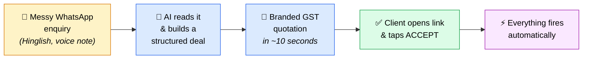
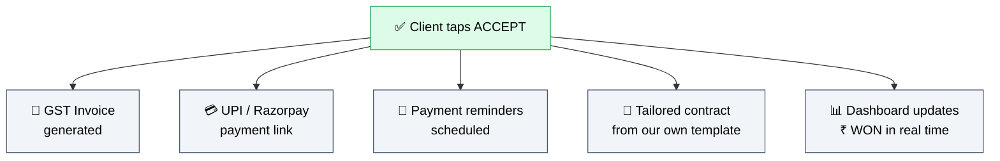
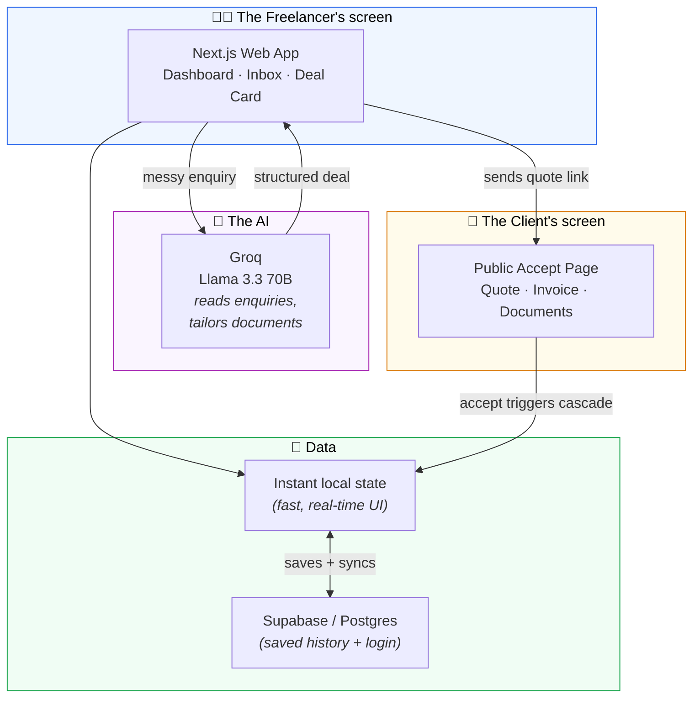

<div align="center">

# KĀRYO
### Client Onboarding Manager

**The AI back-office for India's 15 million freelancers.**
A client messages on WhatsApp → the quote, the GST invoice, the payment link, and a tailored contract happen by themselves.

*Built in 24 hours at TakeOver'26*

</div>

---

## The problem, in one line

> Indian freelancers get client work over **WhatsApp**. Turning a messy voice note into a quote, then an invoice, then chasing payment, then sending a contract — is **hours of manual work for every single client.**

Deals die in the gap between *"I'm interested"* and *"here's your quote."* We run an agency (**KĀRYO**). We live this every week. So we automated it.

---

## What KĀRYO does

You paste a messy client message. KĀRYO does the rest — automatically.



**The moment the client taps Accept — with no human touching anything — KĀRYO creates:**



---

## The one feature that makes this special

Most tools make you **fill a form** to build a quote. KĀRYO **reads the mess** — a rambling Hinglish voice note like:

> *"bhai restaurant ke liye website chahiye, online ordering bhi, budget 30-40k, kitne din?"*

…and turns it into a clean, structured, priced deal. **That's the part a form can't do — and it's the part where deals actually die.**

And the documents aren't generic. **Upload your own agency templates** (contracts, onboarding docs), and the AI tailors each one to the specific client, scope, and price — automatically, the moment they accept.

---

## How it's built (simple version)



**In plain words:** the web app sends the messy message to Groq's AI, gets back a clean deal, saves it to a real database, and gives the client a link. When the client accepts, everything downstream fires on its own.

---

## Tech stack

| Layer | What we used | Why |
|---|---|---|
| **Frontend** | Next.js 16, React 19, TypeScript, Tailwind v4 | Fast, modern, one app |
| **AI / LLM** | Groq — Llama 3.3 70B | Reads messy Hinglish → structured data; free tier, fast |
| **Auth** | Supabase Auth (Google + Email) | Real login, no custom backend |
| **Database** | Supabase (Postgres) | Real, persistent deal history |
| **Documents** | HTML → PDF (print engine) | GST-format quotations & invoices |
| **Email** | Gmail SMTP (Nodemailer) | Sends the quote to the client |
| **Deploy** | Vercel | Live, public URL |

---

## What's real vs. what's a demo boundary

We believe in being honest with judges. Here's exactly what's live and what's simulated:

| Feature | Status |
|---|---|
| AI reading messy Hinglish enquiries | ✅ **Real** — live Groq API call |
| Structured deal extraction | ✅ **Real** |
| Branded GST-format quotation & invoice | ✅ **Real** |
| Document tailoring from our templates | ✅ **Real** — live AI |
| Login (Google + Email) | ✅ **Real** — Supabase Auth |
| Saved deal history | ✅ **Real** — Supabase Postgres |
| UPI / Razorpay **payment link** | ⚠️ **Generated, not settled** — we create the link; real money movement is a production step |
| GST invoice | ⚠️ **Correct GST format** (GSTIN, SAC, tax split) — actual government e-filing is a production step |
| Client data | 🧪 **Demo data only** — no real people's information |

> We never move real money or file real GST during the hackathon — those are clearly marked "demo boundary" in the app.

---

## Why this matters (the market)

- **15 million+ freelancers in India** — the 2nd largest freelance market in the world.
- The freelance economy here is heading toward **~$25 billion by 2026.**
- They work on **WhatsApp**, get paid on **UPI**, and need **GST** invoices.
- The global tools (HoneyBook, Bonsai, Lindy) are built for the **US freelancer** — dollars, Stripe, US tax. **Nobody built this for India.** We did.

---

## Run it locally

```bash
# 1. Install
npm install

# 2. Add environment variables to .env.local
#    GROQ_API_KEY=your_groq_key
#    NEXT_PUBLIC_SUPABASE_URL=your_supabase_url
#    NEXT_PUBLIC_SUPABASE_ANON_KEY=your_supabase_anon_key
#    GMAIL_USER=your_gmail_address        (optional — email)
#    GMAIL_APP_PASSWORD=your_gmail_app_password   (optional — email)

# 3. Run
npm run dev
# open http://localhost:3000
```

---

## Try the demo flow

1. Open the **WhatsApp Inbox** → pick the incoming enquiry.
2. Hit **Process with AI** → watch it build a structured deal.
3. Review the deal card → **Generate Quotation**.
4. Open the **client link** → tap **Accept**.
5. Watch the dashboard: **invoice, payment link, reminders, tailored contract — all created automatically.**

---

<div align="center">

## The team

**Karan Raj KR** — Backend, AI integration, Integration, data, demo
**Havinash Gangisetty** — MCP server, business
**Saagnik Dey** — Frontend

*Founders of KĀRYO — "Your partner in building online presence."*

**Built with ❤️ in 24 hours at TakeOver'26**

</div>
